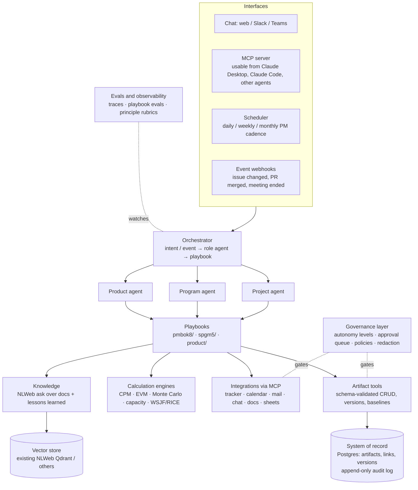

# Agentic Project, Program & Product Manager — Plan

Status: **Decisions made; Phases 0 and 1b built** (see [`pm_agent/`](../../pm_agent/README.md)) ·
Branch: `claude/ai-agentic-manager-pmbok-hfmfis`

This plan describes an AI agent system that acts as a **Project Manager**, **Program
Manager** and **Product Manager**, grounded in PMI's current standards. §0.1 records the
decisions taken and how they changed the plan.

---

## 0. The short version

1. **Build three cooperating agents, not one "super PM" prompt.** PMI draws clear lines
   between the roles, and the agents should too. The Product agent owns *what and why*
   (value). The Program agent owns *benefits across related projects*. The Project agent
   owns *delivering scope on time and on budget*. A shared PMO layer serves all three.
2. **Treat PMBOK as an executable spec.** Each of the 40 PMBOK 8 processes becomes a
   **playbook** with typed inputs and outputs. The 6 principles become **guardrails and
   eval rubrics**. Tailoring becomes a **project profile** that switches processes on or
   off and sets how heavy each one is.
3. **Keep state in a structured system of record, not in chat history.** The LLM reads
   and writes versioned artifacts (charter, registers, baselines, logs) through tools.
   **Plain code does all the math**: critical path, earned value (EVM), Monte Carlo and
   capacity. The LLM never does arithmetic that ends up in a report.
4. **A human stays accountable.** Changing a baseline, spending money, contracts, and
   messages to people outside the team all go through approval gates. Every agent action
   is logged with its rationale and sources.
5. **Reuse NLWeb as the knowledge layer, not as the agent.** Its retrieval stack, MCP
   `ask` endpoint and multi-provider LLM config are useful. Its search pipeline is not an
   agent framework, so the agent goes in a new package (see §7.1).
6. **Ship in thin vertical slices.** Start with the Project agent doing 6 high-value
   processes on real project data. Add change control and governance next, then the
   Program agent, then the Product agent.

### 0.1 Decisions (22 Sep 2026)

| Question | Decision | What it changes |
|---|---|---|
| Who is it for? | **Personal copilot** | No multi-tenancy or auth. **SQLite** instead of Postgres. The CLI is the human side. |
| Which tools? | **GitHub + Google Workspace** | GitHub issues are the tracker: milestones for release scope, labels or a project board for state, labels for points. Interactively, Google Drive, Calendar and Gmail come through the MCP host's connectors. For unattended runs (Phase 1b) the copilot has its own read-only Calendar access and Gmail drafts, with an optional Drive scope for meeting notes. |
| Where does the code live? | **This repo** | New top-level `pm_agent/` package next to NLWeb's `code/`. NLWeb retrieval can be plugged in later for lessons learned. |
| Which kind of project? | **Agile software** | Flow metrics and **Monte Carlo throughput forecasting** are the primary schedule tools. **Agile EVM** (points-based SPI) replaces classic EVM; classic EVM is kept for when cost data exists. CPM is deferred. |
| Model provider | **Claude** (decided later on 22 Sep) | Unattended runs use the Anthropic API with `claude-opus-5`, adaptive thinking and `high` effort, all configurable. Server-side refusal fallback (`fallbacks: "default"`) is on, so a classifier decline is retried on the recommended fallback model instead of failing the run. |

**One architectural consequence:** for a personal copilot, the fastest route is an **MCP
server whose host is the agent**. Claude Code or Claude Desktop runs the playbooks
(served as MCP prompts) and calls our tools, and all state, math and governance live in
our code. Phase 1b added a built-in Claude loop that runs the same playbooks with the same
tools unattended, for scheduled rituals such as the Monday status report.

**Built in Phase 0** (`pm_agent/`, 56 tests):
- artifact schemas;
- a versioned SQLite store with an audit log;
- governance rules enforced on every write;
- engines: flow metrics, Monte Carlo forecast, agile and classic EVM, risk, threshold-based RAG;
- read-only GitHub sync;
- the six Phase 1 playbooks;
- an MCP server, the CLI, and a synthetic demo project.

**Built in Phase 1b** (86 tests in total):
- **Claude runner.** A manual tool-use loop that calls our own MCP server in-process, so
  unattended runs share the interactive tools and guardrails. Each run sees only its
  playbook's tools, writes as a separate actor, stops at 30 turns, and is audited with
  model, usage and outcome.
- **Schedules.** Human-only, timezone-aware. `run-due` is meant for cron; a missed run is
  caught up within 24 hours and skipped after that.
- **Google.** Calendar read, limited by a human-set calendar filter. Meeting notes from
  attached Docs (optional Drive scope). Gmail status drafts to human-set recipients. No
  send path exists.
- **GitHub project board.** The Status field is read over GraphQL and overrides labels for
  open issues; board moves are picked up even when the issue itself didn't change.
- **Scenario evals.** Weekly status, risk discovery, and meeting notes with a planted prompt
  injection. Deterministic checks read the store and audit log. The harness is tested
  offline; the live evals have not been run yet (no API key in the build environment).

---

## 1. What the standards give us

| Source | Structure we encode |
|---|---|
| **PMBOK® Guide, 8th ed. (2025)** | **6 principles:** Adopt a Holistic View · Focus on Value · Embed Quality Into Processes and Deliverables · Be an Accountable Leader · Integrate Sustainability Within All Project Areas · Build an Empowered Culture. **7 performance domains** containing **40 processes:** Governance (9), Scope (6), Schedule (3), Finance (4), Stakeholders (7), Resources (5), Risk (6). **5 focus areas** (the old process groups, now approach-agnostic): Initiating, Planning, Executing, Monitoring & Controlling, Closing. A **Tailoring** section, an **AI appendix (X3)** and a **Procurement appendix (X4)**. |
| **The Standard for Program Management, 5th ed. (2024)** | **8 principles:** Stakeholders · Benefits Realization · Synergy · Team of Teams · Change · Leadership · Risk · Governance. **6 performance domains:** Strategic Alignment · Benefits Management · Stakeholder Engagement · Governance Framework · Collaboration · Life Cycle Management. Plus supporting activities: integration, delivery, performance, change, communications, finance, information and procurement management. |
| **Product management** | PMI doesn't publish a product management standard like the two above. The Product agent is grounded in PMBOK's *system for value delivery* and the program standard's *benefits management*. It adds widely used product practice: discovery, outcome roadmaps, WSJF/RICE prioritization, OKRs and experiments. **This is the one area where we go beyond PMI.** |

> **Copyright note.** PMI's guides are copyrighted. Don't paste guide text into this repo
> or into prompts. Playbooks should be written in our own words and reference processes
> by name. A user with a licensed copy can load it into their *private* knowledge base.

---

## 2. Who owns what

| | **Product Manager agent** | **Program Manager agent** | **Project Manager agent** |
|---|---|---|---|
| Core question | Are we building the *right thing*? | Do the parts add up to the *intended benefits*? | Are we building the thing *right, on time, on budget*? |
| Grounding | Value delivery + product practice | Program standard, 5th ed. | PMBOK 8 (all 40 processes) |
| Key artifacts | Vision, opportunity assessments, outcome roadmap, prioritized backlog, PRDs, success metrics | Business case, program charter, benefits register and realization plan, component roadmap, dependency map, steering packs | Charter, project profile, scope structure (WBS or backlog), schedule, budget, RAID logs, change log, status reports |
| Escalates to | Product leadership (human) | Program sponsor / steering committee (human) | Program agent, then sponsor (human) |

**Shared PMO layer:** artifact store, calculation engines, integrations, governance
and audit, and the knowledge base of lessons learned and organizational process assets.

**How they work together.** The Product agent decides *what's most valuable next*. The
Program agent checks *how that fits the benefits and the other projects*. The Project
agent works out *how, when and at what cost*, then reports back. When they conflict (for
example, Product wants more scope but Project sees schedule impact), the conflict becomes
a **change request** with a full impact analysis, and a human change control board
decides.

---

## 3. Architecture



### 3.1 Key design choices

- **Stateless agent runs over stateful artifacts.** Each run loads what it needs from the
  system of record, acts, writes artifacts back and ends. An approval that arrives three
  days later just starts a new run. This avoids durable-workflow infrastructure early on.
  We can add Temporal or LangGraph checkpoints later if runs get long.
- **Mixed-mode control, the same idea NLWeb uses.** Code decides flow, thresholds and
  status colours. The LLM does judgment work: extraction, synthesis, drafting, trade-off
  reasoning. For example, **RAG status comes from configured variance thresholds, not
  from the model**, so bad news can't be softened.
- **Declarative playbooks.** NLWeb specializes prompts per schema.org type in XML. We
  specialize per PM process in YAML/Markdown (example in §5.4).
- **Two model tiers,** like NLWeb's `high`/`low`. Planning, impact analysis and
  steering-pack reasoning use a frontier model (e.g. Claude Opus 5.5 or Sonnet 5).
  High-volume work such as extraction, classification and meeting-note parsing uses a
  fast model (e.g. Claude Haiku 4.5). Provider stays configurable.

### 3.2 Autonomy levels (the authority matrix)

| Level | Meaning | Examples |
|---|---|---|
| **L0 Inform** | Read, analyze, answer | "What's on the critical path?" "Which risks lack owners?" |
| **L1 Draft** | Produce artifacts or drafts for human review (**default**) | Charter, WBS, CCB packet, status report draft |
| **L2 Act with approval** | Write to external systems after one-click approval | Create tracker tickets, send status email, update a baseline |
| **L3 Autonomous within guardrails** | Routine, reversible, internal; logged afterwards | Add *proposed* risks from meeting notes, nudge task owners, refresh dashboards |
| **Never autonomous** | Always a human decision | Approve baseline or scope changes, commit spend, contracts and procurement, judgments about individual people, messages to customers or anyone outside the org |

A playbook can move up a level for a given project once humans accept its drafts often
enough (for example, ≥90% accepted with light edits over N runs). Promotion is always a
human decision and is logged.

---

## 4. Data model (core artifacts)

Every artifact is a **versioned, schema-validated JSON document** (Pydantic). Each one
records **provenance**: which agent or human wrote it, from which sources, and in which
run. Artifacts link to each other (a risk links to a WBS element, a milestone, a benefit
and a decision), which is what makes cross-domain impact analysis possible. We could also
export to schema.org JSON-LD (`Project`, `Action`, `Event`, `Person`, `Organization`) so
NLWeb can index artifacts natively.

**Project (PMBOK 8)**
- **Project profile (tailoring):** approach (predictive, adaptive or hybrid), size,
  complexity, regulatory load, cadence, active processes and how heavy each one is.
- **Charter:** purpose, objectives with success criteria, high-level scope and exclusions,
  key milestones, budget envelope, key risks, sponsor, PM authority.
- **Stakeholder register:** role, interest, influence, current vs desired engagement
  (unaware, resistant, neutral, supportive, leading), communication preferences.
- **Requirements + traceability matrix**, with acceptance criteria.
- **Scope statement + scope structure:** WBS and WBS dictionary, *or* epics and a story
  map. PMBOK 8's "Develop Scope Structure" allows either.
- **Schedule:** activities, dependencies, three-point estimates, milestones, baselines.
- **Budget:** estimates, cost baseline, reserves (contingency and management), funding
  limits, actuals.
- **Resources:** roles, skills, assignments, capacity, RACI.
- **RAID:** risk register (cause → event → effect, probability, impact, owner, strategy,
  triggers, contingency), issue log, assumption log, decision log.
- **Change log:** change requests with impact on scope, schedule, cost, risk and
  benefits, plus the CCB decision.
- **Quality:** metrics, checklists, definition of done, audit findings.
- **Communications:** comms matrix, status reports, minutes, action items.
- **Lessons learned register.**

**Program (program standard, 5th ed.):** business case, program charter, program
roadmap, **benefits register** (benefit, KPI, baseline, target, owner, expected date,
contributing projects), dependency map, governance calendar and decision records,
program-level risk register.

**Product:** vision, personas, opportunity and problem statements, hypotheses and
experiments, outcome roadmap (now / next / later), scored backlog, OKRs and metrics,
release plans, launch checklists.

---

## 5. PMBOK 8 → agent mapping (the backbone)

Autonomy shows the **default**. "detect → propose" means spotting problems is L3 and the
proposed response is L1.

### 5.1 Project agent: all 40 processes

**Governance (9)**

| # | Process | What the agent does | Output | Autonomy |
|---|---|---|---|---|
| 1 | Initiate Project or Phase | Drafts a charter from intake and business case; runs the tailoring questionnaire | Charter, project profile | L1 (sponsor signs) |
| 2 | Integrate and Align Project Plans | Assembles the plan from subsidiary plans; checks schedule, budget and resources agree | PM plan + consistency report | L1 |
| 3 | Plan Sourcing Strategy | Make-or-buy analysis, vendor options, RFP outline (appendix X4) | Sourcing strategy | L1 only |
| 4 | Manage Project Execution | Syncs the tracker daily, spots blockers, nudges owners, writes stand-up digests | Work performance data, issue log | L3 digests, L2 reassignments |
| 5 | Manage Quality Assurance | Checks deliverables against DoD and acceptance criteria; audits the process (e.g. tickets missing acceptance criteria) | Quality reports | L3 checks |
| 6 | Manage Project Knowledge | Captures decisions and lessons from meetings and threads; indexes them in NLWeb; answers "how did we handle X before?" | Decision log, lessons learned | L3 |
| 7 | Monitor and Control Project Performance | Weekly integrated status: EVM or flow metrics, threshold-based RAG, forecast, variance explanation, recommended actions | Status report, forecast | L2, then L3 once trusted |
| 8 | Assess and Implement Changes | Takes a change request, runs impact analysis with the engines, builds the CCB packet; after approval, updates baselines and notifies people | CR impact analysis, updated baselines | L1 analysis → human decision → L2 |
| 9 | Close Project or Phase | Closure checklist, acceptance evidence, final report, lessons-learned session, hand-off to the benefit owner | Closure report | L1 |

**Scope (6)**

| # | Process | What the agent does | Output | Autonomy |
|---|---|---|---|---|
| 10 | Plan Scope Management | Chooses how scope is defined, validated and controlled (backlog vs WBS) | Scope management approach | L1 |
| 11 | Elicit and Analyze Requirements | Writes interview guides; turns transcripts and docs into requirements with acceptance criteria; flags ambiguity, conflicts and gaps. Works with the Product agent. | Requirements, traceability matrix | L1 |
| 12 | Define Scope | Scope statement with exclusions, assumptions and constraints | Scope statement | L1 |
| 13 | Develop Scope Structure | Builds the WBS or story map; checks the 100% rule; pushes to the tracker on approval | Scope structure | L1 → L2 |
| 14 | Monitor and Control Scope | Spots scope creep: tickets not traced to a requirement, requirement edits in docs; routes them to change control | Creep alerts, draft CRs | detect → propose |
| 15 | Validate Scope | Assembles evidence for each acceptance criterion; records sign-off | Acceptance package | L1 (sign-off is human) |

**Schedule (3)**

| # | Process | What the agent does | Output | Autonomy |
|---|---|---|---|---|
| 16 | Plan Schedule Management | Picks the method (CPM, rolling wave, cadence-based), units and thresholds | Schedule approach | L1 |
| 17 | Develop Schedule | Activities from the scope structure, dependencies, three-point estimates informed by past projects, **CPM in code**, resource-constrained view, **Monte Carlo P50/P80 dates** | Schedule + baseline proposal | L1 (baseline approval is human) |
| 18 | Monitor and Control Schedule | Daily drift vs baseline, critical-path changes, SPI or flow forecasts; recovery options (crash, fast-track, descope) with trade-offs | Variance alerts, recovery options | detect → propose |

**Finance (4)**

| # | Process | What the agent does | Output | Autonomy |
|---|---|---|---|---|
| 19 | Plan Financial Management | Cost accounts, reporting cadence, reserve policy | Financial approach | L1 |
| 20 | Estimate Costs | Bottom-up (resources × rates) and analogous or parametric estimates from history, as ranges with confidence | Cost estimates | L1 |
| 21 | Develop Budget | Rolls estimates up into a time-phased cost baseline (S-curve) with reserves; reconciles with funding limits | Cost baseline proposal | L1 (approval is human) |
| 22 | Monitor and Control Finances | Pulls actuals; **computes EVM in code** (CPI, SPI, EAC, ETC, VAC, TCPI); tracks burn vs funding | Finance dashboard, alerts | L3 compute, L2 report |

**Stakeholders (7)**

| # | Process | What the agent does | Output | Autonomy |
|---|---|---|---|---|
| 23 | Identify Stakeholders | Finds stakeholders in org charts, meeting invitees and docs; classifies power and interest | Stakeholder register | L1 (privacy-guarded) |
| 24 | Plan Stakeholder Engagement | Current vs desired engagement matrix, plus strategies | Engagement plan | L1 |
| 25 | Plan Communications Management | Comms matrix (who, what, when, channel, format). **This also drives the scheduler.** | Comms plan | L1 |
| 26 | Manage Stakeholder Engagement | Briefing notes per stakeholder before meetings; tailored drafts; commitment tracking | Briefings, drafts | L1 / L2 |
| 27 | Manage Communications | Status reports, minutes and action items, tailored by audience (exec one-pager vs team detail) | Reports, minutes | L2, L3 for routine internal items |
| 28 | Monitor Stakeholder Engagement | Aggregate signals (response latency, attendance, feedback); flags key stakeholders who have gone quiet. **No individual surveillance.** | Engagement updates | detect → propose |
| 29 | Monitor Communications | Checks whether messages landed (acks, feedback); adjusts the comms plan | Comms effectiveness notes | L3 |

**Resources (5)**

| # | Process | What the agent does | Output | Autonomy |
|---|---|---|---|---|
| 30 | Plan Resource Management | Roles, skills, RACI, team charter and working agreements | Resource plan | L1 |
| 31 | Estimate Resources | Skill and effort per activity; capacity model | Resource estimates | L1 |
| 32 | Acquire Resources | Finds capacity gaps; drafts staffing requests. The Program agent arbitrates between projects. | Staffing requests | L1 (humans decide) |
| 33 | Lead the Team | *Coaches the human PM*: retro facilitation, working agreements, recognition prompts, early conflict signals. **Never evaluates individuals.** | Facilitation aids | L1 |
| 34 | Monitor and Control Resourcing | Allocation vs capacity, over-allocation, levelling suggestions | Allocation alerts | detect → propose |

**Risk (6)**

| # | Process | What the agent does | Output | Autonomy |
|---|---|---|---|---|
| 35 | Plan Risk Management | Appetite and thresholds, probability × impact scales, risk breakdown structure, cadence | Risk plan | L1 |
| 36 | Identify Risks | Pulls risks from docs, tickets, meeting notes, the assumption log and past lessons; runs pre-mortems; writes them as cause → event → effect | *Proposed* risks | L3 (a human promotes each to "open") |
| 37 | Perform Risk Analysis | Qualitative scoring; quantitative analysis (Monte Carlo, EMV, tornado) when the profile calls for it | Scored risks | L1 / L3 |
| 38 | Plan Risk Responses | Threats: escalate, avoid, transfer, mitigate, accept. Opportunities: escalate, exploit, share, enhance, accept. Also owners, triggers, contingency. | Response plans | L1 |
| 39 | Implement Risk Responses | Creates response tasks in the tracker; follows up with owners | Tracker tasks | L2 |
| 40 | Monitor Risks | Watches triggers, residual and secondary risks, reserves, risk burndown; prepares the weekly review agenda | Risk review pack | L3 |

### 5.2 Program agent: the program standard's 6 performance domains

| Domain | What the agent does |
|---|---|
| Strategic Alignment | Drafts business case, program charter and program plan; checks each project against strategy and OKRs; scans the environment |
| Benefits Management | Maintains the benefits register and realization plan; tracks KPIs against targets; manages hand-over to operational owners; monitors sustainment after close |
| Stakeholder Engagement | Program-level stakeholder analysis and communications, rolled up from the projects |
| Governance Framework | Runs the steering committee cadence, prepares steering packs, logs decisions and phase-gate outcomes, handles program-level change |
| Collaboration | Maintains the cross-project dependency map; detects conflicts (shared people, shared milestones); runs team-of-teams syncs |
| Life Cycle Management | Starts, transitions and closes projects within the program; moves the program through definition, delivery and closure |

### 5.3 Product agent

| Capability | What the agent does |
|---|---|
| Discovery | Summarizes customer feedback, support tickets, interviews and product analytics into opportunities (opportunity solution tree) |
| Strategy | Drafts vision, positioning and OKRs |
| Roadmap | Outcome-based now / next / later roadmap, linked to program benefits |
| Prioritization | WSJF, RICE or Kano. **Scores are computed in code**; the LLM proposes inputs with stated confidence and rationale |
| Requirements | Writes PRDs that feed process 11 (Elicit and Analyze Requirements) |
| Delivery partnership | Backlog refinement, release notes, launch checklists |
| Measurement | Designs experiments, tracks metrics, runs post-launch reviews, and feeds results into the benefits register |

### 5.4 Playbook format (example)

```yaml
id: pmbok8.risk.identify_risks
name: Identify Risks
domain: risk
focus_areas: [planning, executing, monitoring_controlling]
agent: project
triggers:
  - event: meeting_notes.ingested
  - event: assumption.changed
  - schedule: weekly
inputs: [risk_management_plan, assumption_log, issue_log, scope_statement, lessons_learned]
outputs:
  artifact: risk_register
  status: proposed            # a human promotes to "open"
autonomy: L3                  # may add proposed risks without approval
techniques: [document_analysis, prompt_lists, premortem, assumption_analysis]
quality_checks:
  - format: cause_event_effect
  - owner_suggested: true
  - no_duplicates: {semantic_similarity_below: 0.85}
  - cites_source: true
principles: [holistic_view, focus_on_value, accountable_leader]
tailoring:
  small_project: {techniques: [document_analysis, premortem]}
  regulated: {require: [compliance_prompt_list]}
```

---

## 6. Principles → guardrails and evals

**PMBOK 8 principles**

| Principle | Built-in guardrail | How we check it |
|---|---|---|
| Adopt a Holistic View | No change recommendation until the cross-domain impact tool has run. Each recommendation lists effects on scope, schedule, finance, risk, stakeholders and resources. | Rubric: second-order effects named. Tool-call trace shows the impact analysis ran. |
| Focus on Value | Every artifact and decision links to an objective or benefit (required field) | Schema validation; an orphan-artifact report |
| Embed Quality Into Processes and Deliverables | Schema validation, a checklist per artifact, a self-critique pass, and code for all numbers | Deterministic tests; checklist pass rate |
| Be an Accountable Leader | Human approvers, an audit log with rationale and sources, "unknown" is an allowed answer, RAG comes from thresholds | Audit completeness; tests that the agent never fabricates status |
| Integrate Sustainability Within All Project Areas | Environmental, social and economic prompts in charter, business case and risk identification; optional sustainability KPIs in benefits | Rubric on charter and business case |
| Build an Empowered Culture | Supports team decisions instead of dictating them; team can override; respectful nudges; no ranking or surveillance of individuals | Policy tests; team feedback surveys |

**Program standard principles** (Stakeholders, Benefits Realization, Synergy, Team of
Teams, Change, Leadership, Risk, Governance) become rubrics for the Program agent. For
example, *Synergy* asks whether the recommendation considered shared resources and
dependencies across projects, and *Benefits Realization* asks whether each project's
output traces to a benefit with an owner.

---

## 7. Tech stack (recommended)

| Concern | Recommendation | Why |
|---|---|---|
| Language | Python 3.12 | Matches NLWeb; strong data and scheduling libraries |
| Agent loop | Our own thin tool-calling loop on the provider SDKs, with the provider set in config | NLWeb's `ask_llm()` does single-turn JSON completions only, with no tool calls or multi-turn loop |
| API / workers | FastAPI, plus a job queue (arq or Celery) and a scheduler (APScheduler) | Covers events, the PM cadence and approvals |
| System of record | Postgres (JSONB artifacts + relational links + append-only audit table) | Versioning, baselines and joins for impact analysis |
| Knowledge | NLWeb retrieval (Qdrant or others, already supported), called over MCP `ask` or in-process | Lessons learned and project docs |
| Engines | `networkx` (CPM), `numpy` (Monte Carlo), `pandas` (EVM and flow metrics) | Deterministic and testable |
| Integrations | MCP servers: GitHub Issues/Projects or Jira, Google Workspace or M365, Slack or Teams | Swappable; many already exist |
| Interfaces | MCP server first (use it from Claude Desktop or Claude Code), then Slack/Teams bot, then a web dashboard | Cheapest route to real use |
| Evals / observability | pytest for engines, a scenario eval harness, OpenTelemetry traces | See §9 |

### 7.1 Where NLWeb fits and where it doesn't

- **Reuse:** `code/retrieval/*` (vector DB clients), `code/embedding/*`, `code/tools/db_load.py`
  (ingestion), the MCP `ask` endpoint (`code/core/mcp_handler.py`), and the high/low
  model-tier config (`code/config/config_llm.yaml`).
- **Don't build inside:** `code/core/baseHandler.py`. It is a search pipeline
  (decontextualize → retrieve → rank → stream items), not an agent loop. NLWeb also calls
  itself proof-of-concept code with no backwards-compatibility guarantee.
- **Update:** `config_llm.yaml` pins old Anthropic models (`claude-3-7-sonnet-latest`,
  `claude-3-5-haiku-latest`). Move to current ones.

### 7.2 Proposed layout (if we build in this repo)

```
pm_agent/
  schemas/        # Pydantic artifact models: charter, raid, schedule, budget, benefits...
  playbooks/      # pmbok8/ (40), spgm5/ (6 domains), product/  — YAML/Markdown
  agents/         # orchestrator.py, project.py, program.py, product.py
  engines/        # cpm.py, evm.py, montecarlo.py, capacity.py, prioritization.py
  tools/          # artifact_tools.py, impact_analysis.py, integrations/
  governance/     # autonomy.py, approvals.py, audit.py, policies.yaml
  interfaces/     # mcp_server.py, api.py, slack_bot.py, cli.py
  evals/          # golden projects, scenarios, rubrics
  config/         # config_pm.yaml (reuses code/config for LLM + retrieval)
```

---

## 8. Roadmap

Durations are rough and assume 1–2 developers.

| Phase | Scope | Exit criteria |
|---|---|---|
| **0. Foundations** (1–2 wks) — ✅ **done** | Artifact schemas; SQLite store and audit log; governance rules; engines; read-only GitHub sync; MCP server + CLI; a synthetic agile demo project | Agent can read and write artifacts with provenance; engine unit tests pass |
| **1a. Project agent MVP** (3–4 wks) — 🟡 **playbooks built, not yet used on a real project** | Playbooks: **Initiate** (charter + tailoring), **Develop Scope Structure**, **Develop Schedule** (Monte Carlo + agile EVM), **Identify Risks / Perform Risk Analysis**, **Monitor and Control Project Performance** (weekly status), **Manage Communications** (meeting notes → actions, decisions, risks). Tracker read-only; mail as drafts only via the host. Interface: MCP server + CLI. | Used on one real project for 2 weeks. Measure hours saved per week, share of drafts accepted, and risk recall vs the human PM. |
| **1b. Unattended runs** (1–2 wks) — ✅ **built; live evals not yet run** | GitHub Projects Status field (GraphQL); a Claude tool-use loop for scheduled rituals; Gmail drafts and Calendar read via Google APIs; a scenario eval harness | Monday status draft is waiting in Gmail without you opening Claude |
| **2. Control loop and governance** (3–4 wks) | Change control with impact analysis and an approval queue; baselines and variance; autonomy levels; EVM on real actuals; comms plan drives the scheduler; quality checks | A change request goes from detection to approved baseline update with a full audit trail |
| **3. Program agent** (≈4 wks) | Multi-project model, dependency map, benefits register and tracking, steering packs, resource arbitration, program risk roll-up | A slip in one project shows up correctly as impact on another project and on benefits |
| **4. Product agent** (≈4 wks) | Discovery synthesis, outcome roadmap, prioritization engine, PRD → requirements hand-off, launch checklists, outcome metrics feeding benefits | Roadmap items trace to benefits; prioritization is reproducible |
| **5. Hardening and scale** | Remaining processes (sourcing, closure, levelling); SSO/RBAC; multi-tenancy; portfolio view (PMI's portfolio standard); eval-driven tuning | Production readiness review |

---

## 9. Evaluation strategy

- **Golden scenarios.** Synthetic projects with seeded events: vendor slip, scope creep,
  a stakeholder who goes quiet, cost overrun, resource conflict. Score **detection**
  (did it notice?), **analysis** (right impact?), **response** (sensible options and
  correct escalation) and **restraint** (no action above its autonomy level).
- **Deterministic tests.** Schema validity, the WBS 100% rule, CPM against reference
  schedules, EVM formulas, Monte Carlo convergence.
- **Principle rubrics** (§6), run by an LLM judge and spot-checked by humans.
- **Real-use metrics.** Draft acceptance rate, edit distance, hours saved, time from a
  risk appearing to it being logged, how late stakeholders learn about status changes.
- **Safety tests.** No external send without approval; no invented numbers; sources
  cited; PII redaction.
- **Knowledge check.** PMP-style scenario questions *that we write ourselves* (exam
  content is copyrighted). This is a sanity check, not a quality measure.

---

## 10. Worked example: one event, three agents

A vendor posts in Slack: *"The payments API will be 2 weeks late."*

1. **Project agent** (Manage Project Execution) spots the message and logs an **issue**.
2. It runs the **schedule engine**. The critical path moves and milestone M3 slips 8
   working days; Monte Carlo P80 moves from 12 Nov to 25 Nov. The **finance engine**
   prices the idle-team cost. **Identify Risks** adds a *proposed* secondary risk
   (integration testing gets squeezed).
3. It drafts **recovery options** with trade-offs:
   (a) fast-track integration testing,
   (b) descope feature X,
   (c) accept the delay.
4. For option (b) it asks the **Product agent**, which says feature X is low-value per its
   RICE score and moves it to "next".
5. The **Program agent** sees that Project B depends on M3, so one benefit's realization
   date moves a month. It adds the item to the steering pack.
6. A **change request** goes to the human CCB with the full impact analysis. The sponsor
   approves option (b).
7. With L2 approval, the agent updates the baselines, re-plans tracker tickets, notifies
   stakeholders per the comms plan, and records the decision and rationale in the
   decision log.

---

## 11. Decisions needed from you

> All five questions were answered on 22 Sep 2026 (see §0.1).

1. **Who is it for?** A personal copilot for you as a PM, a tool for a team or PMO, or a
   product to sell (multi-tenant SaaS)? This drives auth, tenancy and UI priority.
2. **Which tools does it plug into first?** GitHub Issues/Projects + Google Workspace?
   Jira/Confluence + Slack? MS Project/Planner + Teams? Pick one tracker and one comms
   channel for Phase 1.
3. **Where does the code live?** A new `pm_agent/` package in this NLWeb fork (reuses
   NLWeb's LLM and retrieval layers directly), or a fresh repo that calls NLWeb over MCP?
4. **Which kind of project first?** Agile software, predictive (construction or
   engineering), or hybrid? This decides which playbooks and metrics come first (flow
   metrics vs EVM).
5. **Model and data constraints.** Preferred LLM provider, data residency, and whether
   project data may leave your environment.

---

## 12. Risks to *this* project (our own risk register)

| Risk | Response |
|---|---|
| Agent invents status or numbers | All numbers come from code; sources are cited; "unknown" is allowed; RAG comes from thresholds |
| Tracker data is stale ("garbage in") | Data-quality checks; the agent asks owners to confirm before reporting |
| Too much automation erodes trust and ownership | Autonomy levels, promotion based on acceptance rate, one-click override |
| Privacy and people-analytics concerns | No scoring of individuals; data minimization; aggregate signals only; opt-in |
| Copyright (PMI content) | Playbooks in our own words; licensed guide text only in private knowledge bases |
| Integration sprawl | Phase 1 is limited to one tracker, one comms channel and one docs source |
| Scope creep on this project | Phase gates with the exit criteria in §8 |
