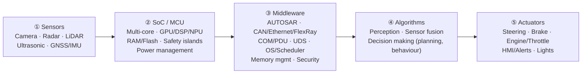

# 01 · Baseline: the conventional ADAS ECU architecture

This is the architecture on the whiteboard, captured as the reference point that the ChromeCar architecture is measured against.

## The five-stage pipeline

| Stage | Role | Attributes on the whiteboard |
|---|---|---|
| ① Sensors | Environment perception, raw data capture | High accuracy, time synchronisation |
| ② SoC / MCU | Data acquisition, pre-processing | Real-time execution, functional safety |
| ③ Middleware | Abstraction layer, standard interfaces | Reliability, scalability |
| ④ Algorithms | AI/ML models, rule-based logic | Real-time inference, adaptive and robust |
| ⑤ Actuators | Execute decisions, vehicle control | Feedback loop, safety critical |

Key points carried over unchanged: end-to-end data flow, real-time performance, functional safety (ISO 26262), cybersecurity (ISO/SAE 21434), continuous monitoring and diagnostics. The mantra is **Sense → Think → Decide → Act**.

## What the baseline assumes, and what that costs

The whiteboard is correct for one ADAS ECU. The problem is that a production vehicle repeats this pattern per domain, and often per function:

| Assumption in the baseline | Consequence at vehicle level |
|---|---|
| Every stage lives on the vehicle | Every function needs its own silicon, memory and power on board, sized for peak load, idle most of the time |
| One SoC/MCU per ADAS box; the same pattern repeats for powertrain, chassis, body, comfort, infotainment, connectivity | 80–100 ECUs per vehicle, 100+ million lines of code, dozens of part numbers and chip variants |
| Point-to-point wiring to sensors and actuators | 40–60 kg of harness (roughly 5 km of wire) per vehicle, mostly copper, routed by hand |
| Middleware bound to one ECU's OS | Software update means touching many ECUs, usually at a dealership |
| Algorithms trained offline, deployed once | Vehicle intelligence is frozen at start of production |
| Diagnostics read out over UDS when the vehicle is in the shop | Failures are found late; no fleet-level learning |

## What must be preserved

The re-architecture does not change the parts of the baseline that exist for safety reasons:

- The **closed loop from sensor to actuator** for any safety goal stays deterministic and on-board.
- **Safety islands** (lock-step cores, ECC memory, independent clocks and power monitors) remain in the compute that hosts ASIL functions.
- **Time synchronisation** across sensors (gPTP / IEEE 802.1AS) remains a hard requirement for fusion.
- **UDS diagnostics** remain the legally required access path, now carried over DoIP and also mirrored to the farm.

The re-architecture changes *where each stage may run* and *how many copies of it a vehicle needs*.
