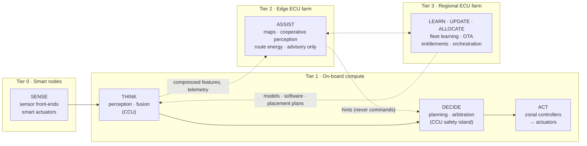
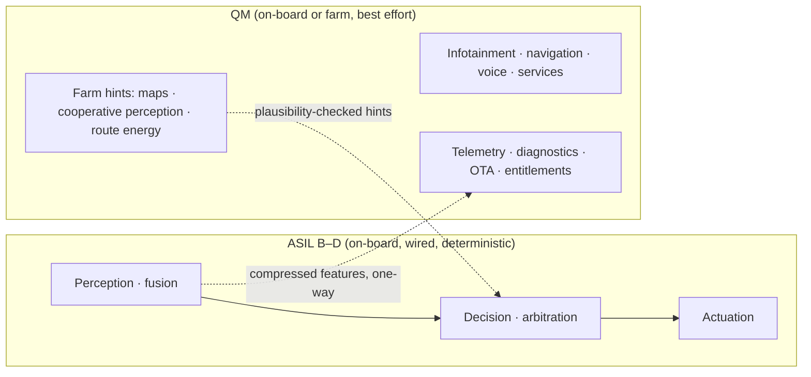

# 02 · Target architecture: ChromeCar four-tier E/E architecture

## Sense-Think-Decide-Act, re-mapped

The baseline runs all four verbs inside one box and repeats the box per function. ChromeCar splits the verbs across four tiers by **criticality and latency**, and adds a fifth verb, **Learn**, that only makes sense once many vehicles share compute.

| Verb | Tier | Runs where | Hard constraint |
|---|---|---|---|
| Sense | 0 | Sensor front-ends with local MCU; smart actuators | Time-stamped at source (gPTP) |
| Think | 1 | Central Compute Unit (CCU) high-performance partition | ≤ 5 ms budget to Decide for ASIL paths |
| Decide | 1 | CCU safety island (ASIL D, lock-step) | No input from Tier 2/3 may be trusted without on-board plausibility check |
| Act | 1 | Zonal controllers, dedicated safety ECUs | Wired only, TSN scheduled |
| Assist | 2 | Edge ECU farm at 5G MEC | Advisory; loss of link = loss of comfort, never loss of function |
| Learn / Update / Allocate | 3 | Regional ECU farm | Asynchronous; everything it sends is signed and staged |

## The four tiers

### Tier 0 · Smart sensors and actuators

- Every sensor and actuator gets a **small MCU** (Cortex-M class) that does signal conditioning, self-test, time-stamping and a standard service interface. This is what makes them "smart" enough to hang off a zonal controller instead of a dedicated ECU.
- **Safety-critical nodes** (brake, steering, airbag satellites, radar, camera, battery cells, inverter) are **wired**: CAN FD or 10BASE-T1S multidrop Ethernet into the nearest zonal controller.
- **Non-safety nodes** (seat modules, cabin climate sensors, ambient lighting, rear-seat displays, door handle/key sensors, occupant and left-item detection) are **wireless**: UWB, BLE or Wi-Fi 6 into the zonal controller's radio. Only their signal wiring disappears; see [weight and harness](#weight-and-harness).

### Tier 1 · On-board compute

**Central Compute Unit (CCU)** — one unit, mixed-criticality, hypervisor-partitioned:

| Partition | OS | ASIL | Hosts |
|---|---|---|---|
| Safety island | AUTOSAR Classic or QNX on lock-step cores | D | ADAS decision, brake/steer arbitration, vehicle motion control, degraded-mode manager, workload arbiter |
| High-performance compute | AUTOSAR Adaptive / POSIX (QNX or Linux) on application cores + NPU | B(D) | Perception, sensor fusion, driver monitoring, localisation |
| Infotainment | Linux or Android Automotive | QM | HMI, media, apps, cloud-streamed content |
| Container runtime | Linux, OCI containers | QM | Farm-placeable workloads (see [05 Orchestrator](05-workload-orchestrator.md)) |

**Zonal controllers (×4: FL, FR, RL, RR)** — each is an AUTOSAR Classic MCU with a safety core, a **48 V / 12 V power distribution stage with e-fuses**, a TSN Ethernet switch up-link to the CCU, CAN FD / LIN / 10BASE-T1S ports for wired nodes and a UWB/BLE/Wi-Fi radio for wireless nodes. Zones own the **Act** verb for everything in their physical corner of the car.

**Connectivity Gateway / TCU** — 5G SA modem (URLLC and eMBB slices), Wi-Fi 6 (station and access point), C-V2X PC5 sidelink, GNSS, and the UWB anchor controller for digital key. Terminates TLS to the farms, bridges SOME/IP ↔ MQTT/gRPC, runs the on-board intrusion detection sensor. It is a **QM** component: nothing safety-related depends on it.

**Dedicated safety ECUs kept on purpose** — airbag/restraint controller (crash-sensing placement and independence), brake actuator ECU, electric power steering ECU, battery management system, traction inverter(s), on-board charger / DC-DC, engine or hybrid control (ICE and hybrid variants). These are kept because ISO 26262 independence arguments and physical placement make them cheaper to keep than to merge.

### Tier 2 · Edge ECU farm

Server-class nodes at the mobile operator's **MEC (multi-access edge compute)** site, one radio hop from the vehicle. Hosts per-vehicle **twin actors** that receive compressed telemetry and return **hints**: HD-map tiles ahead of the vehicle, cooperative perception from other vehicles and roadside units, route and energy optimisation, pre-computed parking guidance. The workload orchestrator's **proposer** also runs here (see [05](05-workload-orchestrator.md)). Latency target ≤ 10 ms RTT on 5G URLLC; **planning assumption 20–50 ms**; every consumer of Tier 2 output must tolerate silence.

### Tier 3 · Regional ECU farm

The data-center-like facility the business plan calls the ECU farm. Hosts everything that is asynchronous by nature:

- OTA campaign management (UNECE R156 SUMS), A/B image staging, feature entitlements and software-unlockable hardware.
- Fleet learning: model training on de-identified fleet data; the models are shipped back to Tier 1 through OTA.
- Digital twin per vehicle for diagnostics, predictive maintenance, warranty analytics, remote UDS over DoIP.
- Services: navigation back-end, voice assistant NLU, payments, owner app back-end.
- Security operations center: fleet IDS correlation, certificate lifecycle, key management.

Siting and power: located in regions with renewable PPAs; the always-on load is sized by number of connected vehicles, not by number of vehicles built, so the farm can be right-sized over time.

## Variants

The same Tier 0–3 design serves gasoline, diesel, hybrid, plug-in hybrid, BEV, fleet and agricultural equipment. The powertrain-specific parts (engine/hybrid controller, BMS, inverter, charger) are **dedicated safety ECUs attached to a zone**; the CCU exposes an abstract *propulsion service* (torque request, energy state, thermal state) so nothing above the zone layer changes between variants. Agricultural equipment adds implement-control nodes as Tier 0 wired nodes and typically uses Wi-Fi 6 / private 5G to a farm-yard Tier 2 node instead of public MEC.

## Weight and harness

The business plan's weight argument is real but the biggest lever is the **harness**, not the ECU housings: a modern vehicle carries roughly 40–60 kg of wiring.

| Lever | Effect |
|---|---|
| Zonal topology | Point-to-point runs to a far-away domain ECU become short runs to the local zone; the CCU sees four Ethernet up-links instead of dozens of buses |
| Wireless QM nodes | Signal wiring to seats, cabin sensors, lighting, displays and door modules disappears |
| 48 V zonal power with e-fuses | Fewer, thinner power conductors; no fuse boxes; nodes get power from the zone, not from a central junction |
| Fewer ECUs | Fewer housings, brackets, connectors and cooling paths |

What does **not** disappear: power wiring to wireless nodes (they still need supply unless battery or energy-harvesting, which is acceptable for low-duty sensors only), and any wiring in an ASIL path.

## Mixed-criticality boundary

The only crossing from QM into ASIL is a **hint channel** into Decide that is treated as an untrusted input: range-checked, rate-limited, time-out guarded, and never able to raise the authority level of a maneuver (a hint can make a lane change *less* likely, never trigger one on its own).
