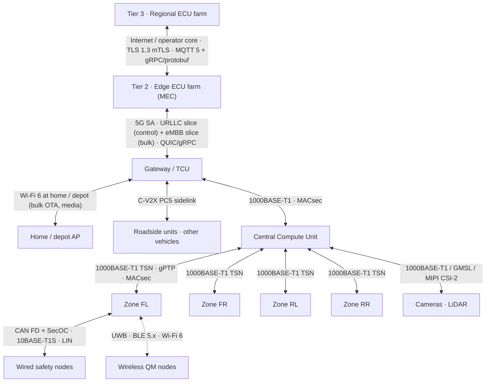

# 04 · Connectivity, middleware and security

## Network topology

### Wired backbone (all ASIL traffic)

| Link | Technology | Why |
|---|---|---|
| CCU ↔ zones | 1000BASE-T1 with IEEE 802.1 TSN (802.1Qbv time-aware shaper, 802.1CB frame replication for redundancy), gPTP (802.1AS) | Deterministic, bounded latency; redundant ring between the four zones and the CCU |
| CCU ↔ high-bandwidth sensors | 1000BASE-T1 / 2.5–10GBASE-T1 (802.3ch), GMSL/FPD-Link for raw camera | Raw perception data never crosses a shared bus |
| Zone ↔ wired nodes | CAN FD with SecOC and AUTOSAR E2E protection; 10BASE-T1S multidrop (802.3cg) for new smart nodes; LIN for the cheapest actuators | Keeps legacy actuators usable; 10BASE-T1S lets several nodes share one twisted pair |
| Power | 48 V zonal distribution with e-fuses in the zone controller; 12 V derived locally | Replaces fuse boxes and thick 12 V runs |

### In-vehicle wireless (QM traffic only)

| Radio | Used for | Notes |
|---|---|---|
| UWB (IEEE 802.15.4z) | Digital key ranging, occupant and child presence, left-item localisation, seat/occupant identification | CCC Digital Key 3.0; anchors in the four zones and the gateway |
| BLE 5.x | Low-rate sensors (cabin temperature, humidity, seat occupancy, TPMS relay), key phone link | Zone controller is the central; nodes are peripherals |
| Wi-Fi 6 / 6E | Rear-seat displays, cabin cameras for QM features, phone projection, hotspot | Gateway is AP; zones may host secondary APs for coverage |

Rules: no ASIL function may consume a wireless input without an independent wired or sensor-derived plausibility source; wireless nodes authenticate with per-node certificates provisioned at end-of-line; all wireless links are encrypted at link layer and again at the service layer.

### Vehicle ↔ farm

| Link | Traffic | Protocol |
|---|---|---|
| 5G SA URLLC slice | Hints, telemetry summaries, orchestration control | gRPC over QUIC, protobuf, mTLS |
| 5G eMBB slice | Bulk telemetry upload, map tiles, media | MQTT 5 (telemetry), HTTP/3 (bulk) |
| Wi-Fi 6 (home, depot, dealership) | OTA images, full logs, model downloads | HTTP/3 with resumable transfer |
| C-V2X PC5 | Cooperative awareness, hazard messages | ETSI ITS-G5 / SAE J2735 message sets |

## Latency budgets

| Path | Budget | How it is met | Assumption for design |
|---|---|---|---|
| Sensor → zone → CCU → actuator (ASIL) | ≤ 5 ms end-to-end | TSN time-aware scheduling, safety-island cyclic tasks at 1 ms, no wireless hop | Hard requirement, verified on HIL |
| Driver input → vehicle response | ≤ 50 ms | Entirely Tier 1 | Hard requirement |
| Driver input → HMI pixel | ≤ 50 ms | CCU IVI partition; ASIL warnings via safety-island overlay | Hard requirement |
| Vehicle ↔ Tier 2 (edge) | ≤ 10 ms RTT target | 5G SA, URLLC slice, MEC co-located at the gNB site | **Plan for 20–50 ms**, treat as best effort; only advisory or accelerator functions use it |
| Vehicle ↔ Tier 3 (regional) | 50–150 ms RTT | Operator core + Internet | Asynchronous only |
| Link loss | Unbounded | Store-and-forward buffers; arbiter pins workloads on board; cached last-known-good | Must be tested as a normal operating mode, not a fault |

The business plan's vehicle-to-cloud < 10 ms goal is realistic only for the edge tier on a 5G standalone network with URLLC and a MEC node one hop away. This architecture therefore reserves that figure for Tier 2 and never lets any safety goal depend on achieving it.

## Middleware stack per tier

| Tier | Runtime | Communication | Notes |
|---|---|---|---|
| T0 smart nodes | Bare-metal or AUTOSAR Classic on Cortex-M | CAN FD signals with SecOC/E2E, 10BASE-T1S SOME/IP-lite, BLE GATT / UWB ranging | Standard service description so a node can be replaced by a different supplier |
| T1 zones | AUTOSAR Classic, safety core | CAN FD ↔ SOME/IP gateway, TSN Ethernet up-link | Own the Act verb and power distribution |
| T1 CCU safety island | AUTOSAR Classic or QNX (ASIL D) | SOME/IP, DDS with TSN mapping | Cyclic executive, lock-step |
| T1 CCU compute | AUTOSAR Adaptive on QNX/Linux, POSIX | SOME/IP, DDS, shared-memory zero-copy for perception | Adaptive Platform for service discovery, execution management, persistency |
| T1 CCU IVI | Android Automotive or Linux + Qt/QML | Vehicle HAL over SOME/IP | Qt for cluster and HMI, Android for apps |
| T1 CCU containers | Linux, OCI runtime, edge agent (AWS IoT Greengrass-class) | gRPC/protobuf, MQTT | Where farm-placeable workloads run when on board |
| T1 gateway | Linux, hardened | SOME/IP ↔ MQTT/gRPC bridge, DoIP/UDS, IDS sensor | QM |
| T2 edge farm | Kubernetes with real-time nodes | gRPC streaming, DDS/Zenoh bridge to vehicle | One twin actor per connected vehicle |
| T3 regional farm | Kubernetes | MQTT broker cluster, gRPC, HTTP/3, data lake, feature store, model registry | Multi-region, renewable-powered |

Schema discipline: one **protobuf schema registry** defines every message that crosses a tier boundary; SOME/IP service interfaces on the vehicle are generated from the same source so a signal has one definition from actuator to data lake.

## Security

Framework: ISO/SAE 21434 TARA on every tier boundary; UNECE R155 CSMS and R156 SUMS as the certification targets; ISO 24089 for the update process.

| Control | Where |
|---|---|
| Hardware security module, secure boot, measured boot, code signing | Every ECU including smart nodes (minimal HSM) |
| Per-vehicle and per-ECU PKI, certificates issued at end-of-line, rotated OTA | T1, managed from T3 |
| SecOC on CAN FD; MACsec on Ethernet; link + service-layer encryption on wireless | T0/T1 |
| Zero-trust between vehicle and farm: mTLS, short-lived tokens, per-service authorisation | T1 ↔ T2/T3 |
| Hint channel into Decide: range check, rate limit, time-out, no authority escalation | CCU safety island |
| Wireless node admission: certificate, proximity proof (UWB), pairing at end-of-line or dealer only | Zones |
| Intrusion detection on board (CAN and Ethernet anomaly, host IDS); fleet correlation and SOC | T1 sensors, T3 analysis |
| OTA: signed images, A/B partitions, rollback, activation only in parked safe state, campaign control per R156 | T3 → T1 |
| Data protection: de-identification before fleet learning; region-pinned storage | T3 |
| Farm hardening: isolated tenants per OEM, HSM-backed signing service, audited access | T2/T3 |
