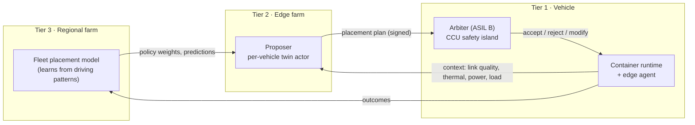

# 05 · Workload orchestrator (AI-driven ECU allocation)

The business plan calls for AI that "analyzes driving patterns to ensure ECUs are allocated where most needed". In this architecture that is the **workload orchestrator**: a placement system for software components across Tier 1 (on board), Tier 2 (edge farm) and Tier 3 (regional farm). It is the mechanism that lets one farm node replace silicon in many vehicles.

## Split of authority



- **Proposer (Tier 2)** sees the vehicle's context and the fleet model and proposes where each placeable workload should run for the next horizon (seconds to minutes).
- **Arbiter (Tier 1, ASIL B)** is the only component that can start, stop or move a workload on the vehicle. It applies hard rules first, then the proposal. If the link is silent the arbiter pins everything on board.
- **Fleet model (Tier 3)** learns from outcomes across the fleet: where link quality is poor on which roads at which hours, which features drivers use in which contexts, how much compute a route will need.

## Workload manifest

Every software component that is not fixed to the safety island carries a manifest:

```yaml
component: route_energy_optimizer
version: 3.2.1
asil: QM                 # QM | A | B | C | D  (B and above are never placeable)
latency_budget_ms: 1000  # end-to-end, including link
tiers_allowed: [T1_container, T2]
fallback: on_board_default_strategy
state: soft              # stateless | soft (rebuildable) | hard (must migrate)
compute: { cpu_ms_per_s: 120, mem_mb: 256, npu_tops: 0 }
bandwidth_kbps: { up: 40, down: 80 }
data_class: telemetry    # drives de-identification and residency rules
```

## Hard rules (evaluated on board, cannot be overridden)

1. `asil >= B` → Tier 1 fixed. Never placeable, never proposed.
2. `latency_budget_ms < 3 × measured_link_rtt_ms` → Tier 1.
3. Link quality below threshold (RSRP, packet loss, jitter) → all placeable workloads Tier 1, farm outputs treated as absent.
4. OTA activation, key provisioning, entitlement changes → only in parked safe state.
5. A placement plan must be signed by Tier 2 with a certificate chained to the OEM root and must be fresher than 30 s.

## Optimisation the proposer performs (within the rules)

| Signal | Example decision |
|---|---|
| Driving mode: parked and charging on Wi-Fi | Stage OTA, upload full logs, run model refresh; on-board compute in low-power state |
| Driving mode: highway, strong 5G | Move HD-map prefetch, route energy optimiser and voice NLU to Tier 2; keep on-board headroom for perception |
| Driving mode: urban, congested cell | Bring route optimiser back on board; drop cooperative perception hints |
| Predicted coverage gap ahead (fleet model) | Pre-fetch map tiles and pre-compute the next 10 km of energy plan before entering the gap |
| Thermal or power headroom low on CCU | Shed QM containers to Tier 2 first, then reduce IVI quality |
| Feature usage pattern (fleet) | Pre-warm the containers a driver uses at this time of day; do not load the others |
| Agricultural / fleet depot with private 5G | Treat the depot node as Tier 2 with a tighter latency budget |

## Why this is the cost lever

A per-vehicle ECU is sized for peak demand and sits idle most of the time. A farm node is sized for the *sum of concurrent demand* across thousands of vehicles, which is far smaller than the sum of peaks. The orchestrator is what converts that statistical multiplexing into fewer chips per vehicle without changing what the driver experiences. The savings are bounded by the hard rules: anything at ASIL B or above still needs its own on-board silicon, and that is the correct boundary.

## Observability

Every placement decision is logged with context, proposal, arbiter verdict and measured outcome (latency achieved, fallback triggered, user-visible degradation). These logs are the training data for the fleet model and the evidence for the safety case that the arbiter's hard rules were never violated.
