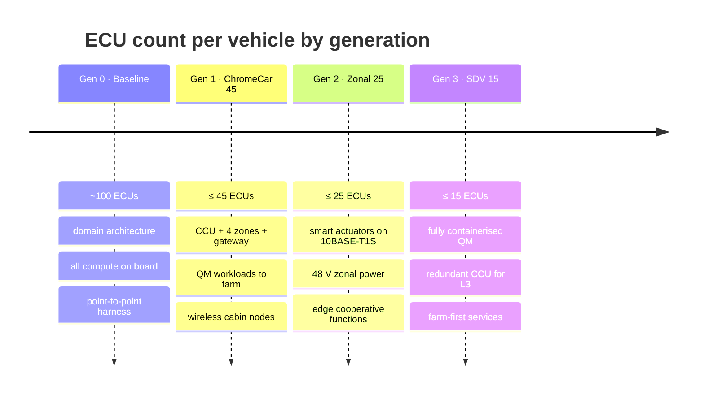

# 06 · Roadmap and validation

## Generations

## ECU budget, Gen 1

The business-plan target is about 45 ECUs. This is how the budget is spent. Smart nodes with their own MCU are counted as ECUs so the comparison with the baseline is honest.

| Group | Units | Notes |
|---|---|---|
| Central Compute Unit | 1 | Hypervisor, safety island, compute, IVI, containers |
| Zonal controllers | 4 | FL, FR, RL, RR; power distribution and radios |
| Connectivity gateway / TCU | 1 | 5G, Wi-Fi 6, C-V2X, UWB anchor controller |
| Dedicated safety ECUs | 8 | Restraint, brake, EPS, BMS, inverter, charger/DC-DC, powertrain (ICE/hybrid), steering column lock |
| ADAS sensor front-ends with local processing | 7 | 5 radar, 1 front camera module, 1 LiDAR (variant) |
| Body smart nodes, wired (ASIL A/B) | 10 | 4 door modules, front and rear lighting, tailgate, sunroof, HVAC actuator node, wiper |
| Cabin smart nodes, wireless (QM) | 14 | Seats ×4, cabin sensor cluster ×2, rear displays ×2, ambient lighting ×2, steering wheel controls, overhead console, key/UWB satellites ×2 |
| **Total** | **45** | |

What replaced the missing ~55: navigation, voice, telematics apps, diagnostics analytics, HD map, fleet analytics, entitlements, OTA orchestration, payments and owner-app back-ends moved to the farm; roughly 30 body and comfort ECUs collapsed into the four zones; the ADAS, cluster, head unit and gateway domain controllers collapsed into the CCU.

## Cost and weight model

| Item | Baseline | Gen 1 | Lever |
|---|---|---|---|
| ECUs | 80–100 | 45 | Consolidation and offload |
| Distinct chip part numbers | dozens | ~12 families | Shared MCU family for zones and nodes, one SoC family for CCU |
| Harness mass | 40–60 kg | target −30 to −40% | Zonal runs, wireless QM nodes, 48 V distribution |
| Per-vehicle compute idle most of the time | yes | QM compute pooled in farm | Orchestrator |
| Software update | dealer visit, per ECU | OTA per R156, A/B | CCU + farm |
| Electronics share of vehicle cost | ~40% | business-plan target −30 to −40% of that share | All of the above; to be validated per programme |

The $150-per-vehicle price point in the business plan is a reference-design and software licence; the farm is billed as a per-connected-vehicle service, which is what makes right-sizing possible.

## Phased delivery

| Phase | Scope | Exit criterion |
|---|---|---|
| 0 · Lab | SIL model of Tier 0–3; protobuf schema registry; arbiter hard rules | Arbiter never violates a hard rule across 10⁶ randomised link/context scenarios |
| 1 · HIL bench | Real CCU + 4 zones + gateway, simulated sensors and actuators, emulated 5G with latency and loss injection, Tier 2/3 on lab Kubernetes | ≤ 5 ms ASIL path under full TSN load; ≤ 50 ms driver input path; zero safety-goal violations during link loss storms |
| 2 · Mule vehicle | Retrofit into one donor vehicle from an OEM partner; QM functions live on farm; wireless cabin nodes | Drive cycles with forced link loss show no drivability change; ISO 26262 concept phase (item definition, HARA, FSC) signed off |
| 3 · Demo fleet | Detroit, Dallas, San Jose showroom vehicles on public 5G with an operator MEC partner | Measured Tier 2 RTT distribution published; orchestrator savings quantified (on-board compute-hours avoided) |
| 4 · Production intent | Gen 1 ECU budget met; R155/R156 audit; supplier sourcing with domestic chip preference | Type-approval-ready evidence package |

## Validation matrix

| Claim | How it is proven |
|---|---|
| Safety goals never depend on the link | Fault injection: link cut, link delayed 0–5 s, link corrupted, MEC returns malicious hints. Pass = no ASIL function changes behaviour outside its specified degraded mode |
| ≤ 5 ms ASIL path | HIL timing measurement with TSN analyser under worst-case traffic; formal schedulability analysis of the safety island |
| ≤ 50 ms driver input | End-to-end latency probe from pedal/steering/HMI input to actuator and pixel |
| Tier 2 ≤ 10 ms achievable | Field measurement on 5G SA URLLC with MEC; report percentile distribution, not a single number |
| Wireless nodes cannot affect ASIL functions | Penetration test: jamming, spoofing, rogue node admission; TARA per ISO/SAE 21434 |
| Orchestrator hard rules | Model checking of the arbiter; logged evidence from fleet |
| Weight and harness reduction | Bill-of-materials mass comparison on the mule vehicle |
| Cost reduction | Should-cost model per programme, validated with OEM partner sourcing |

## Open decisions

| Decision | Options | Recommendation |
|---|---|---|
| CCU SoC family | Automotive SoC with integrated safety island vs. SoC + separate ASIL-D MCU | Integrated safety island for Gen 1 (fewer parts); revisit for redundant CCU in Gen 3 |
| Hypervisor | Type-1 automotive hypervisor vs. separate boards | Type-1 hypervisor; mixed criticality is the point of the CCU |
| Edge partner model | Operator MEC vs. OEM-owned edge racks at operator sites | Operator MEC for public roads; OEM-owned for depots and agricultural yards |
| Cabin wireless transport for displays | Wi-Fi 6E vs. 60 GHz | Wi-Fi 6E; 60 GHz only if in-cabin camera bandwidth demands it |
| Orchestrator learning location | Fleet model in Tier 3 only vs. on-device personalisation | Tier 3 only in Gen 1; keeps the on-board arbiter simple and certifiable |
