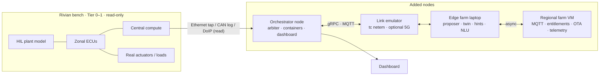

# 08 · Prototype plan: ChromeCar on a Rivian bench

**Audience:** Chief Software Officer. **Form:** existing Rivian E/E bench plus three added compute nodes. **Status:** plan only, no code yet.

## The one question the demo must answer

> Does the vehicle stay safe and drivable when the cloud disappears, while the cloud visibly does real work the rest of the time?

Everything below exists to answer that live, with measurements on screen, in ten minutes.

## Why this bench, and what the story becomes

Rivian's Gen 2 architecture is already zonal (publicly reported: 17 ECUs down to 7, about 1.6 miles of wiring removed, roughly 44 lb saved). So the consolidation half of the ChromeCar story is already Rivian's. The pitch to the CSO is the **next step**: keep the zonal vehicle exactly as it is, add the ECU farm tiers around it, and prove with the orchestrator and link-loss tests that QM workloads can leave the car while the ASIL loop never notices.

## What the bench gives, what we add

| | Provides | Rule |
|---|---|---|
| **Bench (Tier 0–1, untouched)** | Zonal ECUs, central compute, Ethernet and CAN networks, real loads and actuators, HIL plant model, diagnostic access (DoIP/UDS) | Read-only. No software change on any ASIL ECU. We tap the network, we do not write to it. |
| **Orchestrator node (add, Tier 1 QM)** | Small Linux box on the bench Ethernet: workload arbiter, container runtime for placeable workloads, telemetry client, dashboard back-end | Behaves as one more QM ECU. Talks to the bench only through signals we are allowed to read. |
| **Link emulator (add)** | Linux router between the orchestrator node and the edge: `tc netem` for delay, jitter, loss and cut; optional real 5G modem path | Makes every scenario repeatable. |
| **Edge farm (add, Tier 2)** | Laptop or server on the far side of the emulator: proposer, per-vehicle twin, hint generator, HD-map tiles, route-energy optimiser, voice NLU | Advisory only. |
| **Regional farm (add, Tier 3)** | One cloud VM: MQTT broker, entitlement and OTA staging service, telemetry sink, fleet-model stub | Asynchronous only. |
| **Dashboard (add)** | Browser page fed by the orchestrator node: workload placement, link RTT, on-board CPU, safety-loop latency trace, ECU tiles, event log | The thing the CSO looks at. |

## Demo scenarios and pass criteria

| # | Scenario | What happens | Pass criterion on screen |
|---|---|---|---|
| 1 | Highway, strong 5G | Emulator set to 15 ms RTT. Proposer moves navigation, voice NLU and route-energy to the edge. | Placement tiles flip to "edge"; orchestrator-node CPU drops; safety-loop latency trace unchanged. |
| 2 | Tunnel | Emulator cuts the link for 60 s. | Safety-loop trace stays flat; HIL vehicle keeps driving; navigation shows "cached route"; arbiter pins all workloads on board within 1 s; hints marked absent. |
| 3 | Congested cell | Emulator set to 120 ms RTT, 5 % loss. | Arbiter pulls the route-energy optimiser back on board because budget < 3× RTT; voice NLU stays on edge because its budget allows it. |
| 4 | Malicious hint | Edge sends an out-of-range cooperative-perception hint. | Hint rejected at the plausibility check, logged with reason, no downstream effect. |
| 5 | Feature unlock over the air | Regional farm issues a signed entitlement while the "vehicle" is parked. | Feature appears on the dashboard HMI panel; the same push is refused while the HIL reports the vehicle in motion. |

Every scenario runs from one button on the dashboard so the demo cannot drift.

## Measurements

| Measurement | How | Why it matters |
|---|---|---|
| Safety-loop latency | Inject a pedal or steering step in the HIL plant; timestamp the actuator response on the bench CAN/Ethernet with a hardware-timestamped interface; plot continuously | The flat line during scenarios 2 and 3 is the whole argument |
| Link RTT, loss, jitter | Probe from orchestrator node to edge every 100 ms | Shows the arbiter reacting to real conditions |
| Placement by tier | Arbiter state | Shows compute leaving and returning |
| Orchestrator-node CPU and memory | Node exporter | Proxy for silicon that a production car would not need |
| Compute-hours offloaded | Sum of edge container CPU time during the run | Feeds the cost slide |
| Arbiter decisions | Structured log: context, proposal, verdict, reason | Evidence for the safety-case story |

## Workloads to implement (all QM, all containerised)

| Workload | Minimum viable version | Placeable? |
|---|---|---|
| Navigation routing | Open-source router on a public map extract; cached last route on board | Yes |
| Voice NLU | Wake word on board; intent model in edge container | Yes |
| Route-energy optimiser | Simple gradient/speed-based energy model over the route | Yes |
| HD-map tile server | Static tiles served from edge, cached on board | Edge only |
| Cooperative-perception hints | Scripted object list with a range check on the receiving side | Edge only |
| Telemetry pipeline | Compressed signals to MQTT, store-and-forward when link is down | On board, sink in cloud |
| Entitlement and OTA staging | Signed JSON entitlement; parked-state gate | Cloud, enforced on board |
| Arbiter | Hard rules from [05](05-workload-orchestrator.md); manifest per workload | On board, fixed |
| Proposer | Rule-based for the demo; fleet-model hook left open | Edge |

## Software stack

Python (asyncio) services; MQTT (Mosquitto) and gRPC/protobuf across tiers, matching [04](04-connectivity-middleware-security.md); Docker Compose per node; Linux `tc netem` on the emulator; CAN and Ethernet capture via python-can with the bench's Intrepid or Vector interface; DoIP/UDS via a Python UDS client; browser dashboard with live charts. One protobuf schema registry shared by every service.

## Bill of materials beyond the bench

| Item | Qty | Purpose | Est. cost |
|---|---|---|---|
| Small Linux PC (NUC-class or Jetson Orin) | 1 | Orchestrator node | $400–900 |
| Linux router box with two NICs (Raspberry Pi 4/5 or spare laptop) | 1 | Link emulator | $100–200 |
| Laptop or workstation | 1 | Edge farm | existing |
| Cloud VM, small | 1 | Regional farm | ~$50/month |
| 100/1000BASE-T1 media converter (Intrepid RAD-Moon or Technica) | 1–2 | Attach standard Ethernet to the bench T1 network | $300–600 each |
| CAN interface with hardware timestamps (Intrepid ValueCAN or Vector VN16xx) | 1 | Safety-loop timing probe | existing on most benches |
| 5G modem or hotspot | 1 | Optional real-link scenario | $100–300 |
| Second monitor | 1 | Dashboard | existing |

Total new spend: roughly $1,000–2,500.

## Schedule, six weeks

| Week | Deliverable | Exit check |
|---|---|---|
| 1 | Bench access confirmed; read-only tap points identified; protobuf schemas; docker skeleton for all three nodes | Signals needed for the timing probe are readable |
| 2 | Arbiter with hard rules; link emulator scripted; dashboard shows RTT and placement | Scenario 2 passes with stub workloads |
| 3 | Real workloads: navigation, voice NLU, route-energy; proposer rules | Scenario 1 and 3 pass |
| 4 | Safety-loop timing probe on the bench; hint plausibility check; entitlement service | Scenarios 4 and 5 pass; latency trace live |
| 5 | Dry runs, one-button scenarios, numbers panel, failure recovery | Full ten-minute run three times without intervention |
| 6 | Buffer, polish, rehearsal with a friendly audience | Demo day |

Team: you plus one embedded engineer for the bench tap and probe, one backend engineer for the farm services.

## Risks

| Risk | Mitigation |
|---|---|
| Bench network is T1 and ASIL traffic is not readable | Media converters plus a mirror port; if signals are locked, use the HIL plant's own outputs for the timing probe |
| Bench booking, who may attach nodes, what data may leave the lab | Confirm in week 1; keep all bench data on the lab side of the emulator |
| Real 5G is unpredictable on demo day | Run every scenario on the emulator; show real 5G only as a bonus |
| Demo drifts into a debugging session | One-button scenarios, rehearsed three times |
| CSO asks "why not just do this in the head unit" | Have the numbers panel ready: compute-hours offloaded, and the arbiter log proving safety never depended on it |

## Ten-minute script

| Min | Beat |
|---|---|
| 0–1 | Figure 2 on screen: "Rivian already did consolidation. This is the next tier." |
| 1–3 | Scenario 1: workloads move to the edge; CPU drops; safety trace flat |
| 3–5 | Scenario 2: cut the link; car keeps driving; everything returns on board; trace still flat |
| 5–6 | Scenario 3: congested cell; arbiter makes a partial decision, explain the 3× rule |
| 6–7 | Scenario 4: malicious hint rejected and logged |
| 7–8 | Scenario 5: feature unlocked while parked, refused while moving |
| 8–10 | Numbers panel, then the three asks |

**The three asks:** sponsorship for a hardware-bench Phase 2 with real 5G and an operator MEC partner; one production program to run the orchestrator in shadow mode; a decision on where the ECU farm lives (operator MEC, own racks, or hyperscaler).
