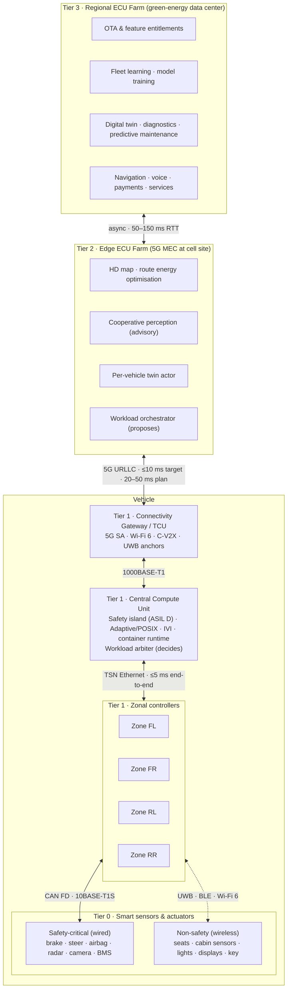

# ChromeCar E/E Architecture

Re-architecture of the conventional ADAS ECU stack for the **Fully Connected Car (d/b/a ChromeCar)** concept: fewer ECUs, ECU farms, wireless in-vehicle connectivity, real-time cloud integration and AI-driven ECU allocation.

| | |
|---|---|
| **Basis** | Whiteboard "ADAS ECU Architecture" (Sensors → SoC/MCU → Middleware → Algorithms → Actuators, all on-board) and the ChromeCar EB-2 NIW business plan (Nov 2023) |
| **Status** | Rev A, concept architecture for review |
| **Owner** | Prajwal Nimmagadda, CTO |

## Documents

| # | Document | What it answers |
|---|---|---|
| 01 | [Baseline ADAS ECU architecture](01-baseline-adas-ecu.md) | What the whiteboard architecture is and what it locks in |
| 02 | [Target architecture](02-target-architecture.md) | The four-tier ChromeCar architecture and how Sense-Think-Decide-Act maps onto it |
| 03 | [Function allocation](03-function-allocation.md) | Function by function: which tier hosts it, its ASIL, its latency budget, what happens when the link drops |
| 04 | [Connectivity, middleware and security](04-connectivity-middleware-security.md) | Wired backbone, in-vehicle wireless, vehicle-to-farm links, software stack per tier, ISO/SAE 21434 controls |
| 05 | [Workload orchestrator](05-workload-orchestrator.md) | The AI-driven ECU allocation engine |
| 06 | [Roadmap and validation](06-roadmap-and-validation.md) | How to get from ~100 ECUs to 45 and beyond, and how to prove it |
| 07 | [On-board vs cloud](07-onboard-vs-cloud.md) | Every feature, which side it lives on, one line why |
| 08 | [Prototype plan](08-prototype-plan.md) | Demo on a Rivian bench for the Chief Software Officer: scenarios, measurements, bill of materials, six-week schedule, script |
| — | [diagrams/](diagrams/) | Standalone SVGs: [baseline pipeline](diagrams/01-baseline-adas-ecu.svg) and [ChromeCar target architecture](diagrams/02-chromecar-target-architecture.svg) |

## The architecture in one picture

## Design principle

> **Sense-Think-Decide-Act stays whole on the vehicle for anything that can hurt someone. Everything else is a candidate to leave the vehicle. The farm Learns, Updates and Allocates.**

The business plan places **non-safety-critical** functions in the ECU farm and keeps safety-critical sensors and actuators on the vehicle (its architecture figure marks the two in red and blue). This architecture formalises that same line where ISO 26262 draws it: any function with a safety goal at ASIL B or above runs on-board, closed-loop, with no dependency on the wireless link; everything at QM is a candidate for the farm. The link is treated as a **QM resource** that can vanish at any time. The ECU reduction comes from three places:

1. **Consolidation**: ~100 domain ECUs collapse into one central compute unit, four zonal controllers and a short list of dedicated safety ECUs.
2. **Offload**: every non-real-time, non-safety workload (navigation, voice, telematics apps, diagnostics analytics, HD maps, fleet learning, entitlements, OTA orchestration) moves to the ECU farm, where one server-class node serves many vehicles.
3. **Wireless cabin**: non-safety sensors and actuators talk to their zonal controller over UWB, BLE or Wi-Fi 6, removing their signal harness.

## Business-plan targets and the mechanism that delivers each

| Business-plan target | Architectural mechanism | Where it is specified |
|---|---|---|
| ECUs per vehicle 100 → ~45 | Central compute + 4 zones + dedicated safety ECUs + smart nodes; QM workloads to farm | [06 Roadmap](06-roadmap-and-validation.md#ecu-budget-gen-1) |
| Critical in-vehicle latency < 5 ms | Wired TSN Ethernet backbone, safety island scheduling, no wireless hop in any ASIL path | [04 Connectivity](04-connectivity-middleware-security.md#latency-budgets) |
| Vehicle-to-cloud latency < 10 ms | 5G SA URLLC to a MEC node co-located at the cell site (Tier 2); planning assumption 20–50 ms; farm functions are advisory or async | [04 Connectivity](04-connectivity-middleware-security.md#latency-budgets) |
| Driver input response < 50 ms | Handled entirely on-board (zones + CCU) | [03 Allocation](03-function-allocation.md) |
| Remote feature implementation | OTA per UNECE R156 with A/B partitions; feature entitlements in Tier 3 | [04 Connectivity](04-connectivity-middleware-security.md#security) |
| AI-driven ECU allocation | Workload orchestrator: farm proposes placement, on-board arbiter decides | [05 Orchestrator](05-workload-orchestrator.md) |
| Weight reduction / less copper | Zonal topology, 48 V zonal power distribution with e-fuses, wireless QM nodes | [02 Target](02-target-architecture.md#weight-and-harness) |
| 30–40% lower electronics cost | Fewer part numbers, shared silicon, per-vehicle compute replaced by pooled farm compute | [06 Roadmap](06-roadmap-and-validation.md) |
| Green-energy ECU farms | Tier 3 siting and power specified in target architecture | [02 Target](02-target-architecture.md#tier-3-regional-ecu-farm) |
| Works on ICE, hybrid, PHEV, BEV, fleet, farm equipment | Powertrain is one zonal-attached dedicated ECU family; everything above it is powertrain-agnostic | [02 Target](02-target-architecture.md#variants) |

## Standards referenced

ISO 26262 (functional safety), ISO 21448 (SOTIF), ISO/SAE 21434 (cybersecurity engineering), UNECE R155 (CSMS) and R156 (SUMS), ISO 24089 (software update engineering), AUTOSAR Classic and Adaptive, IEEE 802.1 TSN, IEEE 802.3bw/ch/cg (automotive Ethernet), 3GPP Rel-16/17 (5G URLLC, C-V2X), ETSI MEC, CCC Digital Key 3.0 (UWB/BLE).
